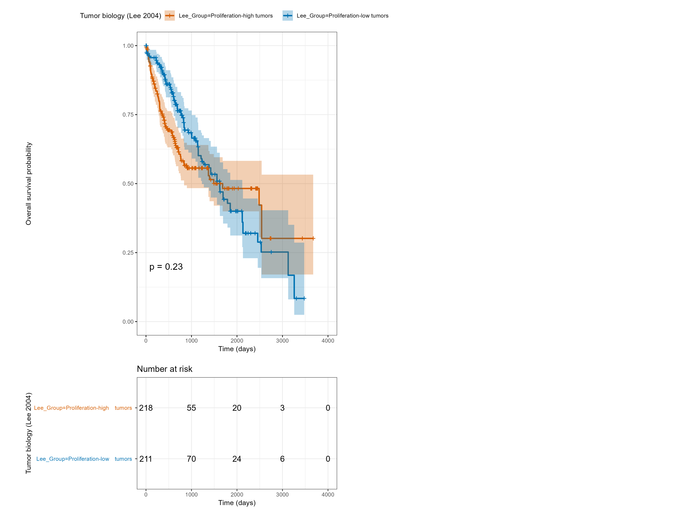
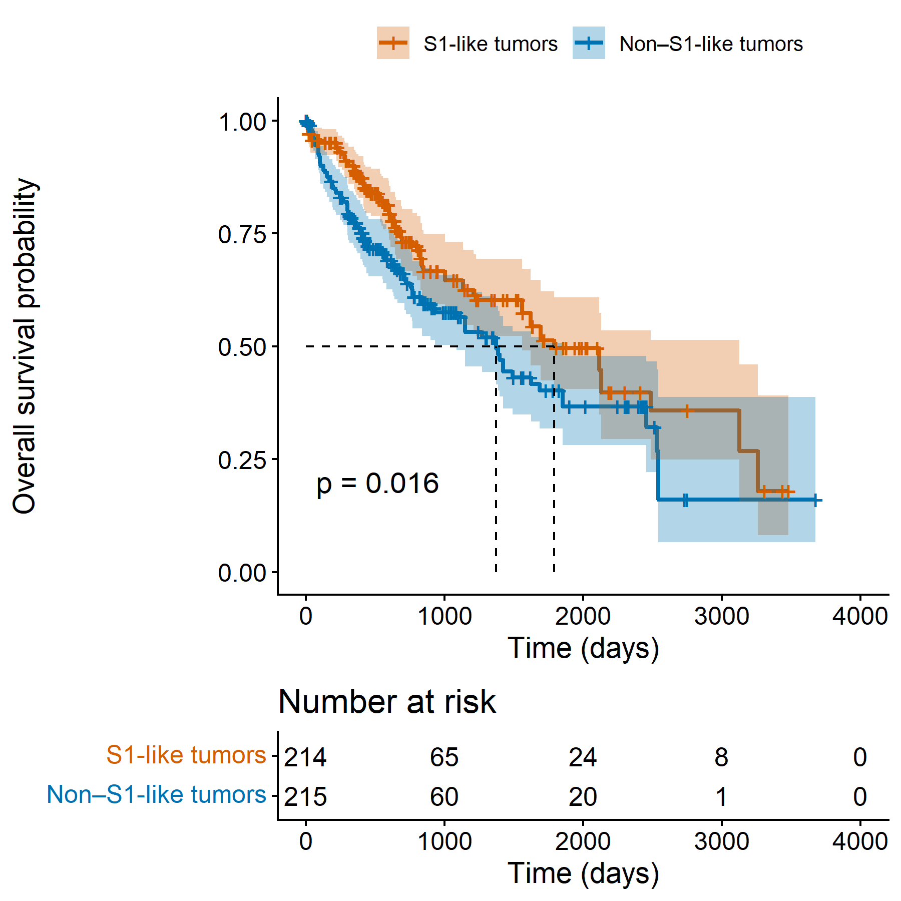
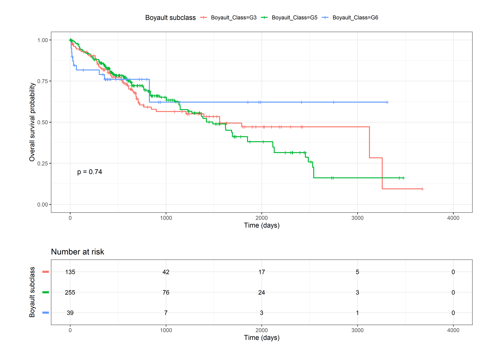
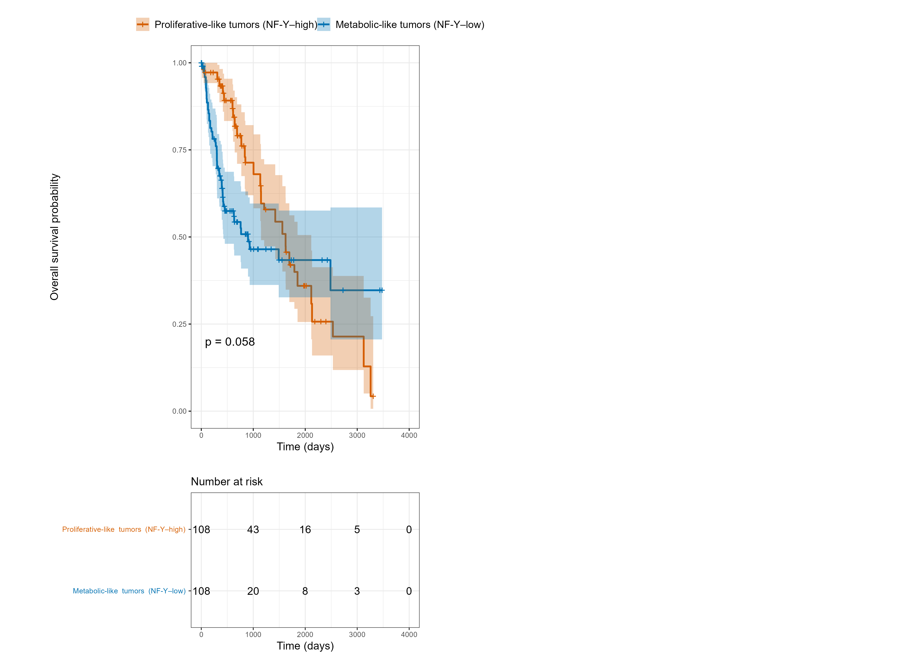

# TCGA-LIHC Survival Signatures

This repository reproduces and compares **well-established molecular
classification and survival-associated gene signatures** for
hepatocellular carcinoma (HCC) using **TCGA-LIHC RNA-seq data**.

The goal of this project is **biological fidelity and transparency**:
each analysis closely follows the original publication logic rather than
using black-box machine learning models.

---

## Overview

Hepatocellular carcinoma exhibits strong molecular heterogeneity.
Multiple landmark studies have defined tumor subclasses associated with
distinct biology and patient outcomes.

This repository implements survival analyses based on the following
published frameworks:

| Study | Biological concept |
|-----|-------------------|
| Lee et al. 2004 | Proliferation-driven tumors |
| Hoshida et al. 2009 | S1 inflammatory subclass |
| Boyault et al. 2007 | Molecular subclasses (G1–G6) |
| Bezzecchi et al. 2020 | NF-Y–driven proliferative vs metabolic tumors |
| Chiang-style | CTNNB1 vs proliferation programs |

All analyses are performed on **TCGA-LIHC** using **TPM-normalized RNA-seq**
and curated overall survival data.

---
## Example survival analyses

### Lee et al. 2004 — Proliferation signature

---

### Hoshida et al. 2009 — S1 inflammatory subtype

---

### Boyault et al. 2007 — Molecular subclasses

---

### Bezzecchi et al. 2020 — NF-Y–driven tumors

---

### Chiang-style — CTNNB1 vs proliferation programs

## 📁 Repository structure

<pre>
tcga-lihc-survival-signatures/
├── scripts/
│   └── 02_signatures/
│       ├── lee2004_proliferation.R
│       ├── hoshida2009_s1.R
│       ├── boyault2007_subclasses.R
│       ├── bezzecchi2020_nfy.R
│       └── chiang_ctnnb1_vs_proliferation.R
│
├── figures/
│   ├── lee2004/
│   ├── hoshida2009/
│   ├── boyault2007/
│   ├── bezzecchi2020/
│   └── chiang/
│
├── environment/
│   └── session_info.txt
│
└── README.md
</pre>

---

## Data sources

This repository assumes access to the following data (not included here):

- **TCGA-LIHC RNA-seq TPM matrix**
- **TCGA curated overall survival data**
- Published gene lists from original studies:
  - Lee 2004
  - Hoshida 2009
  - Boyault 2007
  - Bezzecchi 2020
- MSigDB Hallmark gene sets (for Chiang-style analysis)

All scripts use **gene-symbol–level expression** with careful
Ensembl-to-HGNC mapping.

---

## Analysis approach

Across scripts, the general workflow is:

1. Load TCGA expression and survival data  
2. Map Ensembl IDs to gene symbols  
3. Compute biologically motivated signature scores  
4. Stratify tumors into high/low or subtype groups  
5. Perform Kaplan–Meier overall survival analysis  

Quartile-based or median-based stratifications are used depending on the
original publication logic.

---

## Notes on reproducibility

- Scripts are written to be **explicit and readable**, not compact
- No machine learning models are used
- All assumptions (cutoffs, weights, gene sets) are stated in code
- File paths are parameterized via `base_dir` for portability

---

## Intended audience

This repository is intended for:

- Cancer biology researchers
- Computational biologists
- Students learning survival analysis in genomics
- Anyone interested in biologically interpretable tumor stratification

---

## Citation

If you use ideas or structure from this repository, please cite the
original publications:

- Lee et al., *Cancer Cell*, 2004  
- Hoshida et al., *NEJM*, 2009  
- Boyault et al., *Hepatology*, 2007  
- Bezzecchi et al., *Hepatology*, 2020  

---

## Author

**Naghmeh Rezaei**  
Computational biology | Cancer genomics | Survival analysis

